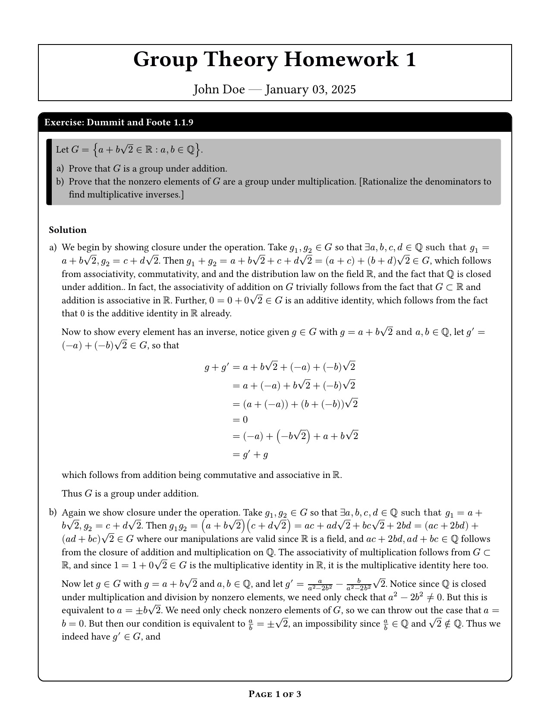
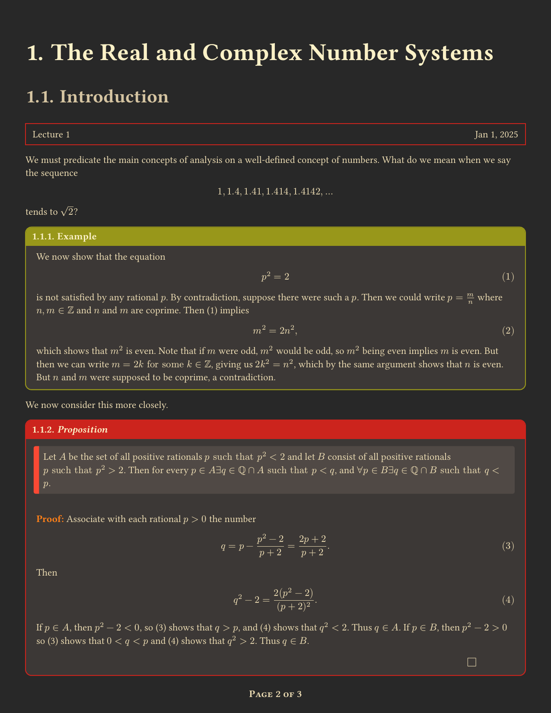
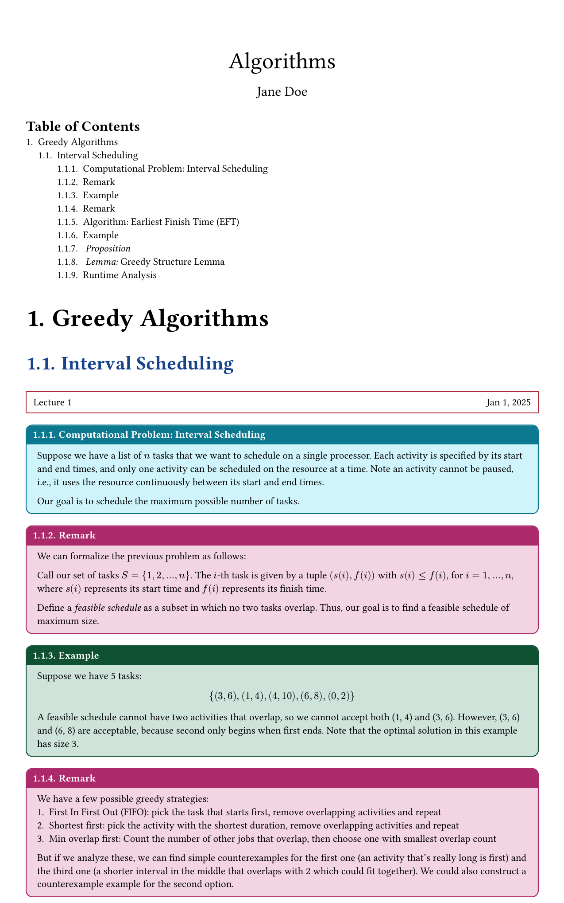
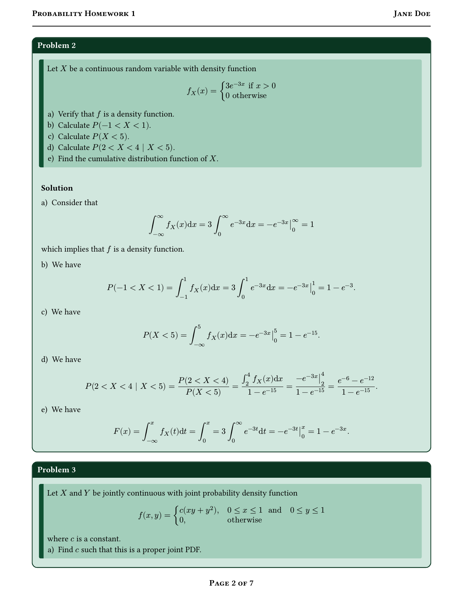
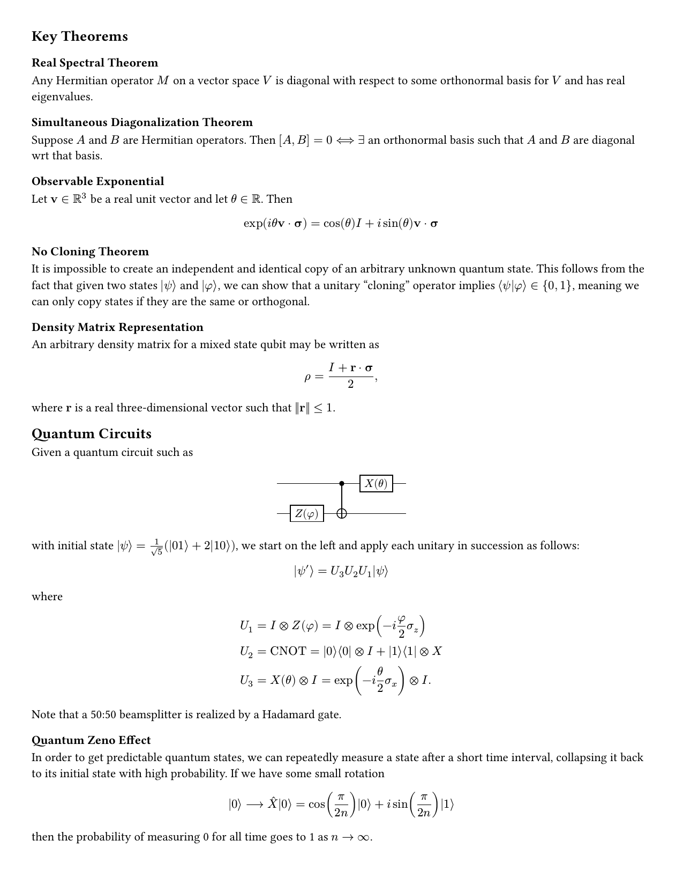

# superTemplate

A [`Typst`](https://github.com/typst/typst) suite of templates and macros for taking notes, doing problem sets, and writing reports in Mathematics, Computer Science, Physics, and Engineering.
This is best used as a companion to [our other package](https://github.com/EsotericSquishyy/superTheorems).

> [`Typst`](https://github.com/typst/typst) is required to use this package.
> You can get started by via the integrated language service [`Tinymist`](https://github.com/Myriad-Dreamin/tinymist) or by referring to Typst's [installation page](https://github.com/typst/typst?tab=readme-ov-file#installation).
> Note that [`Tinymist`](https://github.com/Myriad-Dreamin/tinymist) currently supports `VSCode`, `NeoVim`, `Emacs`, `Sublime Text`, `Helix`, and `Zed`.

## Gallery

<p float="left">
    
    
    
    
    
</p>

See how these are rendered in `./examples`.

## Installation

1. Clone this repository somewhere locally on your machine.

2. `cd` into the repository and use the setup script in `./scripts` to install.
(This only works if you are on Mac or Linux.)
If you are on Windows or would prefer to do this manually, refer to the [Typst Packages](https://github.com/typst/packages) repository for more information.

3. Test whether the installation worked by opening a new `.typ` file in any directory with the following code:
    ```typ
    #import "@local/superTemplate:0.3.0": *
    #import math_mod: *
    #show: basic

    #cyc(1, 2, 3) Hello world!
    ```
    If you're able to render the pdf, you're good to go.

4. Check out the examples in `./examples` to get started.
